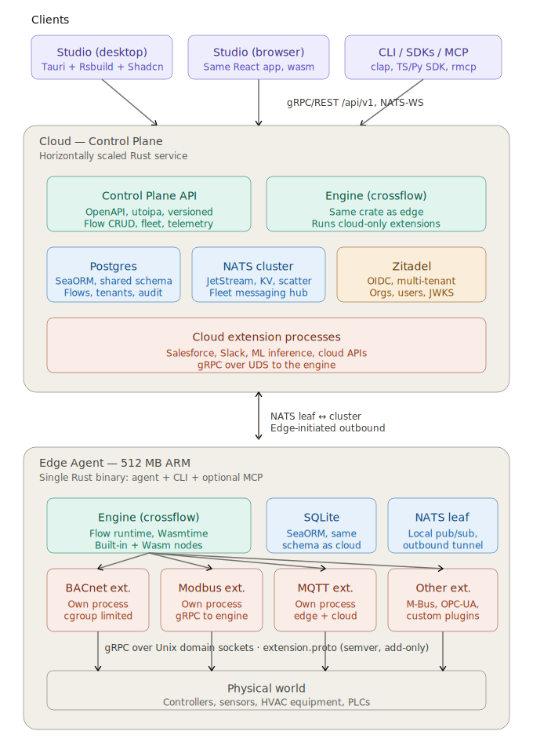

# Platform Overview

Listo ships as **one Rust agent binary** cross-compiled for ARM64/x86 Linux (plus a Tauri Studio for desktops and a browser SPA). Deployment profile — `cloud`, `edge`, `standalone` — is chosen at runtime via `--role`, not at build time. Block authors and frontend developers consume **published SDK crates and npm packages**, not forks of the core.

Codebase is organised as a **multi-repo workspace** under [`github.com/listo-ai/`](https://github.com/listo-ai). Repos are checked out side-by-side on disk and driven end-to-end with [`mani`](https://github.com/alajmo/mani) — a small Go-based multi-repo orchestrator.

---

## The workspace — repos, roles, and ownership boundaries

Every listo repo has a single clear responsibility. The rule of thumb: if you're thinking about more than one row of this table, you're about to break a layering invariant.

| Repo | On disk | Lang | Published as | What it owns |
|---|---|---|---|---|
| [`contracts`](https://github.com/listo-ai/contracts) | `workspace/contracts` | Rust | `listo-spi`, `listo-ui-ir` (crates.io) + generated TS types | Wire types (`Msg`, `KindManifest`, `NodePath`, slot schemas), UI-IR component tree, `block.proto`, JSON Schemas. **Zero deps on anything internal.** The dependency root. |
| [`agent`](https://github.com/listo-ai/agent) | `workspace/agent` | Rust | — (private) | The core platform: `engine`, `graph`, `blocks-host`, `domain-*`, `dashboard-*`, `data-*`, `transport-*`, `auth`, `messaging`, `ai-runner`, and the `apps/agent` binary. Consumes `listo-spi` as a git/crates.io dep. |
| [`agent-sdk`](https://github.com/listo-ai/agent-sdk) | `workspace/agent-sdk` | Rust | `listo-blocks-sdk`, `listo-blocks-sdk-macros` (crates.io) | Block-author SDK: `NodeBehavior` trait, `#[derive(NodeKind)]`, `NodeCtx`, `run_process_plugin()`. What every Rust block depends on. |
| [`agent-client-rs`](https://github.com/listo-ai/agent-client-rs) | `workspace/agent-client-rs` | Rust | `listo-agent-client` (crates.io) | Standalone Rust HTTP client. `.nodes()`, `.slots()`, `.flows()`, `.ui()`, etc. Zero dep on the agent's internals. |
| [`agent-client-ts`](https://github.com/listo-ai/agent-client-ts) | `workspace/agent-client-ts` | TS | `@listo/agent-client` (npm) | TS HTTP client. Types generated from `contracts/codegen` — no hand-maintained type drift. |
| [`agent-client-dart`](https://github.com/listo-ai/agent-client-dart) | `workspace/agent-client-dart` | Dart | `listo_agent_client` (pub.dev) | Dart/Flutter HTTP client for mobile / Flutter UIs. |
| [`ui-kit`](https://github.com/listo-ai/ui-kit) | `workspace/ui-kit` | TS | `@listo/ui-kit` (npm) | Shadcn primitives + design tokens. **Zero logic, zero hooks.** Any React app uses these for visual consistency. |
| [`ui-core`](https://github.com/listo-ai/ui-core) | `workspace/ui-core` | TS | `@listo/ui-core` (npm) | The portable "brain" — auth (OIDC), SDUI renderer, graph store, block loader, fleet scope, agent hooks. Consumed by Studio AND by alternative frontends. |
| [`block-ui-sdk`](https://github.com/listo-ai/block-ui-sdk) | `workspace/block-ui-sdk` | TS | `@listo/block-ui-sdk` (npm) | Curated re-export facade over `ui-core` for block MF bundles. Stable, versioned. Block UI authors depend on this and nothing else. |
| [`studio`](https://github.com/listo-ai/studio) | `workspace/studio` | TS | — (private) | The Studio app. Rsbuild + React 19 + Module Federation host. One consumer of `ui-core` + `ui-kit`; customers can build alternatives. |
| [`desktop`](https://github.com/listo-ai/desktop) | `workspace/desktop` | Rust | — (private) | Shared Tauri shell (`src-tauri`) for packaging Studio as a native desktop app on Windows/macOS/Linux. |
| [`blocks`](https://github.com/listo-ai/blocks) | `workspace/blocks` | Rust/TS | — (reference) | Example and reference blocks (`com.acme.hello`, `com.listo.mqtt-client`, `com.listo.bacnet`). Each is a standalone Cargo crate + optional MF UI bundle consuming the published SDKs — exactly what third-party block authors do. |
| [`agent-cli`](https://github.com/listo-ai/agent-cli) | `workspace/agent-cli` | Rust | — (private) | MCP bootstrap CLI — different from the `agent <cmd>` CLI inside `transport-cli` (which ships inside the agent binary). |
| [`listod`](https://github.com/listo-ai/listod) | `workspace/listod` | Rust | — (private) | Supervisor daemon — manages agent lifecycle, OTA updates (A/B slots, rollback), opt-in consent on cloud/edge/desktop. |
| [`repos-cli`](https://github.com/listo-ai/repos-cli) | `workspace/repos-cli` | Go | — (internal) | This tool (mani config + helpers). |
| [`docs`](https://github.com/listo-ai/docs) | `workspace/docs` | MD | — | Shared design specs + developer docs that outgrew any single repo. |

### The dependency arrow — always points this way

```
contracts ──┬─────────────┬──────────────────────┐
            ↓             ↓                      ↓
        agent-sdk     agent-client-rs     agent-client-ts (TS types via codegen)
            ↓             ↓                      ↓
         blocks       agent binary          ui-kit ─┐
            ↓             ↓                         │
    (loaded at runtime)   │                     ui-core
                          │                         │
                          │                 block-ui-sdk
                          │                         │
                          ├─────────────────► studio (+ desktop Tauri shell)
                          │                         ↑
                          └── REST/NATS ◄───────────┘
```

**Invariants enforced by the split:**

- Nothing depends on `agent` — the core is a dead-end in the graph. If you catch yourself wanting `agent` in a consumer's `Cargo.toml`, you want `contracts` or `agent-client-rs` instead.
- `blocks` consumes `agent-sdk` but never the agent — block authors ship binaries that the agent loads at runtime over UDS gRPC (process blocks) or Wasmtime (Wasm blocks).
- `ui-kit` has no hooks, no stores, no API calls. Putting one in is a PR-rejection-worthy layering violation.
- `block-ui-sdk` is a curated re-export facade; blocks never reach into `ui-core` directly.

---

## Getting started — `mani` is the entry point

### Install mani once

```bash
# macOS / Linux
curl -sSfL https://git.io/_mani | sh -
# or: brew install alajmo/mani/mani
```

### Bootstrap the whole workspace

```bash
cd ~/code
git clone https://github.com/listo-ai/repos-cli workspace/repos-cli
cp workspace/repos-cli/mani.yaml workspace/mani.yaml   # or symlink it
cd workspace

mani sync                 # clones every repo listed in mani.yaml
mani run onboard          # sync + tools-check + pnpm install + services up + build
```

Everything `mani` does is driven by [`workspace/mani.yaml`](../../../mani.yaml) — repo map, task definitions, filtering tags.

### The mental model

- **`mani run <task>`** executes the task in every repo (optionally filtered).
- **`mani sync`** clones missing repos, skips existing ones.
- **`mani exec <cmd>`** runs an arbitrary shell command against repos.
- Filters: `--projects agent,studio` (by name), `--tags rust` (by tag), `--all` (everywhere).

Tags in `mani.yaml` are meaningful:

| Tag | Meaning |
|---|---|
| `rust` | Rust project (has `Cargo.toml`) |
| `ts` | TypeScript project (has `package.json` + `pnpm build`) |
| `go` | Go project |
| `dart` | Dart/Flutter project |
| `published` | Published to a public registry (crates.io / npm / pub.dev) |
| `core` | Mission-critical, breaks the whole system if broken |
| `sdk` | Public API consumed by third parties |
| `client` | HTTP client library |
| `ui` | Frontend package |

So `mani run cargo-test --tags rust` runs the test suite in every Rust repo.

---

## Day-to-day commands (the cheat sheet)

Below every task resolves to a `mani run <task>` invocation defined in `mani.yaml`. Run `mani list tasks` to see the full set; run `mani describe task <name>` to see its shell command.

### Build / test everything

```bash
mani run build --all          # auto-detects Cargo.toml / package.json / go.mod / pubspec.yaml
mani run test  --all          # same
mani run status --all         # per-repo branch + ahead/behind + uncommitted count
```

### Dev servers for the agent

All of these live under the `agent` project (dev configs + scripts are in `workspace/agent/dev/`). Every dev task is defined once in `mani.yaml` so "which port pairs with which agent" is documented, not remembered.

| Command | What it starts | Agent | Studio |
|---|---|---|---|
| `mani run dev-single --projects agent` | Standalone role, no fleet | `:8080` | `:3000` |
| `mani run dev-cloud  --projects agent` | Cloud role | `:8081` | `:3002` |
| `mani run dev-edge   --projects agent` | Edge role | `:8082` | `:3010` |
| `HTTP_PORT=8083 STUDIO_PORT=3011 mani run dev-edge --projects agent` | Second edge for fleet testing | `:8083` | `:3011` |
| `mani run dev        --projects agent` | Full env — cloud + edge together, both Studios | `:8081`+`:8082` | `:3002`+`:3010` |
| `mani run kill-dev   --projects agent` | Kills everything on those ports | — | — |

> **One agent per port, one studio per port.** If you see "connection closed by peer" or duplicate client IDs in MQTT logs, `mani run kill-dev --projects agent` clears the slate.

### Cleanup

```bash
mani run clean-edge     --projects agent    # wipe edge.db + edge-blocks/*
mani run clean-cloud    --projects agent    # wipe cloud.db + cloud-blocks/*
mani run clean-single   --projects agent    # wipe single.db + single-blocks/*
mani run clean-rust     --tags rust         # cargo clean --workspace across every Rust repo
mani run clean          --all               # rm target/ + node_modules/ + dist/
```

### Git across repos

```bash
mani run fetch          --all               # git fetch --all --prune
mani run pull           --all               # git pull current branch
mani run main-pull      --all               # checkout main + pull

BRANCH=feat/my-thing mani run branch-new    --projects agent,studio
MSG="feat: wire foo"  mani run commit       --projects agent,studio
                     mani run push          --projects agent,studio
```

### Codegen (Rust types → TypeScript)

```bash
mani run codegen          # regenerates agent-client-ts/src/generated/ from contracts
```

Run after any change to types in `contracts/spi/src/*.rs` whose schemas cross the Rust↔TS boundary.

### Interim release commands

```bash
mani run release-rust-dry --tags "rust,published"   # cargo publish --dry-run
mani run release-npm-dry  --tags "ts,published"     # pnpm publish --dry-run
```

Full release orchestration (tag + publish + pin) is still manual — tracked as M17 in [REFACTOR-MULTI-REPO.md](../sessions/REFACTOR-MULTI-REPO.md).

---

## Where does my change go? A decision tree

Work backwards from what you're touching to the repo that owns it.

| If you want to change… | Edit in | Then |
|---|---|---|
| A wire type (`Msg`, slot schema, `KindManifest`) | `contracts/spi/` | `mani run codegen` to regenerate TS, bump consumers |
| A Studio page, button, route | `studio/src/` | `pnpm build:web` (hot-reload during dev) |
| A Shadcn primitive or design token | `ui-kit/src/` | `pnpm build` in ui-kit; every consumer picks it up on next rebuild |
| SDUI renderer, auth provider, graph store | `ui-core/src/` | Same |
| A block's Rust handler | `blocks/<id>/process/` | `cd blocks/<id> && make edge` — hot-reloads into running edge agent |
| A block's UI panel | `blocks/<id>/ui-src/` | Same `make edge` rebuilds UI + triggers MF reload |
| Add a new core node kind (like `sys.logic.function`) | `agent/crates/domain-*/` | Register in `apps/agent/src/main.rs` |
| New HTTP route on the agent | `agent/crates/transport-rest/` | Also add to `agent-client-rs` and `agent-client-ts` (the latter via codegen if types change) |
| Block-author SDK surface | `agent-sdk/blocks-sdk/src/` | Blocks using path deps pick it up immediately; published blocks need a republish |
| The `agent <cmd>` CLI | `agent/crates/transport-cli/` | Binary rebuilt with the agent |
| The MCP bootstrap CLI | `agent-cli/` | Separate binary, separate release cadence |

---

## Deployment profiles

One binary, one codebase. Role selected at startup via `--role` flag or config. These are the supported combinations.

| Profile | Role | Host | Typical hardware | What runs | Database | NATS |
|---|---|---|---|---|---|---|
| **Cloud — multi-tenant SaaS** | `cloud` | Linux containers, Kubernetes or VMs | Horizontally scaled, 2–8 GB per pod | Control Plane API, fleet orchestrator, cloud-side engine, cloud-only blocks | Postgres (managed, HA) | NATS cluster with JetStream |
| **Cloud — single-tenant** | `cloud` | Linux VM, Docker, or bare metal | 1 VM, 2–4 GB RAM | Same as above, single replica | Postgres (single instance) | NATS single-node with JetStream |
| **Edge — ARM gateway** | `edge` | Raspberry Pi, industrial gateway | aarch64, 512 MB RAM, 8+ GB storage | Engine, local blocks, NATS leaf, local SQLite | SQLite | NATS leaf (Core only; JetStream off) |
| **Edge — x86 gateway** | `edge` | Industrial PC, Intel NUC | x86_64, 1–4 GB RAM | Same as ARM edge; JetStream optional | SQLite | NATS leaf (JetStream opt-in) |
| **Edge — legacy ARM** | `edge` | Older hardware | armv7, 256–512 MB RAM | Stripped features, no JetStream, reduced outbox | SQLite | NATS leaf (Core only) |
| **Standalone appliance** | `standalone` | Single box on-prem | 2–4 GB RAM | Everything — Control Plane + engine + blocks | SQLite or embedded Postgres | NATS embedded single-node |
| **Developer laptop** | `standalone` | macOS / Windows / Linux | Dev machine | Everything in one process | SQLite | NATS embedded |
| **Studio — desktop** | (client) | Windows / macOS / Linux | Any modern PC | Tauri shell (from `desktop` repo) + Studio UI | — | NATS WebSocket client |
| **Studio — browser** | (client) | Any modern browser | Desktop or mobile browser | Static SPA | — | NATS WebSocket client |
| **Studio — iOS / Android** (future) | (client) | iOS 16+ / Android 10+ | Phones, tablets | Tauri mobile shell or `agent-client-dart` + Flutter | — | NATS WebSocket client |

## Build targets (Rust triples)

| Target | Triple | Used by | Cross-compile from |
|---|---|---|---|
| Edge ARM 64 | `aarch64-unknown-linux-gnu` | Edge agent on Pi 4/5, industrial gateways | Any, via `cross` or Docker |
| Edge ARM 64 (musl) | `aarch64-unknown-linux-musl` | Static edge binary, Alpine-based images | Any, via `cross` |
| Edge ARM 32 | `armv7-unknown-linux-gnueabihf` | Older ARM gateways | Any, via `cross` |
| Edge / cloud x86 | `x86_64-unknown-linux-gnu` | Cloud servers, x86 gateways | Native Linux or `cross` |
| Edge / cloud x86 (musl) | `x86_64-unknown-linux-musl` | Static binaries for Alpine / scratch containers | Native Linux or `cross` |
| Studio Windows | `x86_64-pc-windows-msvc` | Tauri desktop | Windows native, or Linux via `cargo-xwin` |
| Studio macOS Intel | `x86_64-apple-darwin` | Tauri desktop on Intel Macs | macOS native (notarization requires it) |
| Studio macOS ARM | `aarch64-apple-darwin` | Tauri desktop on Apple Silicon | macOS native |
| Studio Linux | `x86_64-unknown-linux-gnu` | Tauri desktop | Native Linux |
| Browser Studio | `wasm32-unknown-unknown` | Any Wasm crates needed in-browser | Any |
| Wasm blocks | `wasm32-wasip1` or `wasm32-unknown-unknown` | Block authors, not us | Any |

## Distribution artifacts

| Artifact | Format | Target | Distribution channel |
|---|---|---|---|
| Edge agent — ARM 64 | Single static binary + systemd unit | `aarch64-unknown-linux-gnu` | Debian repo, OCI image, direct download, OTA via `listod` |
| Edge agent — x86 | Single static binary + systemd unit | `x86_64-unknown-linux-gnu` | Same |
| Edge agent — Docker | OCI image | Multi-arch manifest (ARM 64, x86) | Docker Hub, GHCR, private registry |
| Cloud — OCI image | Docker image | Multi-arch | Private registry, Kubernetes |
| Cloud — Helm chart | Helm package | Kubernetes | Helm repo |
| Standalone appliance | Single binary or OCI image | x86 or ARM | Direct download, Docker |
| Studio Windows | `.msi` + auto-updating `.exe` | Windows | Direct download, winget, auto-update |
| Studio macOS | Notarized `.dmg` (universal) | macOS | Direct download, Homebrew cask, auto-update |
| Studio Linux | `.AppImage`, `.deb`, `.rpm`, Flatpak | Linux | Direct, apt/rpm repos, Flathub |
| Studio browser | Static SPA | Any browser | Hosted by Control Plane, or CDN, or bundled with edge agent for local admin |
| Studio iOS (future) | `.ipa` | iOS | App Store, TestFlight |
| Studio Android (future) | `.apk` / `.aab` | Android | Play Store, direct APK |

## What runs where — capability matrix

| Capability | Cloud | Edge ARM | Edge x86 | Standalone | Studio desktop | Studio browser |
|---|---|---|---|---|---|---|
| Control Plane API | ✓ | — | — | ✓ | — | — |
| Flow engine | ✓ | ✓ | ✓ | ✓ | — | — |
| Native Rust blocks | ✓ (cloud-side) | ✓ (edge-side) | ✓ (edge-side) | ✓ | — | — |
| Wasm blocks | ✓ | ✓ | ✓ | ✓ | ✓ (preview only) | ✓ (preview only) |
| Protocol blocks (BACnet, Modbus, MQTT) | — | ✓ | ✓ | ✓ | — | — |
| Cloud-API blocks (Salesforce, Slack) | ✓ | — | — | ✓ | — | — |
| NATS cluster (JetStream) | ✓ | — | — | embedded | — | — |
| NATS leaf | — | ✓ | ✓ | n/a | — | — |
| NATS client over WebSocket | — | — | — | — | ✓ | ✓ |
| SQLite | — | ✓ | ✓ | ✓ | — | — |
| Postgres | ✓ | — | — | optional | — | — |
| Zitadel | ✓ (external) | — | — | ✓ (bundled) | — | — |
| File system access | full | full | full | full | scoped | virtual only |
| Local agent discovery | — | — | — | — | ✓ (Unix socket) | ✓ (WebSocket if exposed) |
| Offline operation | partial | full | full | full | full when paired with local agent | read-only cache |

## Memory budgets

| Deployment | Target RSS | Notes |
|---|---|---|
| Edge ARM 256 MB legacy | ≤ 180 MB | Stripped features, no JetStream, fewer concurrent flows |
| Edge ARM/x86 512 MB | ≤ 350 MB | Full feature set, JetStream with small retention window |
| Standalone 2 GB | ≤ 1.2 GB | Everything in one process, moderate tenant count |
| Cloud pod | 2–8 GB | Horizontally scaled, set per workload |
| Studio desktop | 150–400 MB | Tauri shell + React app + WebView |
| Studio browser | 80–200 MB | No native shell overhead |

## Multi-tenancy

- **Cloud** is multi-tenant; tenant == Zitadel Organization. Postgres row-level security + NATS accounts partition data and subjects per tenant.
- **Edge agent is single-tenant.** One gateway belongs to one tenant. Multi-tenant edge (e.g. MSP hosting multiple customers on one box) is **not supported in v1** — the 350 MB memory budget and shared-process model don't give real isolation, and claiming it would be dishonest. Customers needing hard isolation per tenant on-site get one agent per tenant.
- **Standalone** appliances are single-tenant by definition (one org owns the box).

---

## Key libraries

One library per concern. Don't introduce alternatives — if a crate is listed here, use it. If you think you need something not on this list, discuss before adding.

| Concern | Crate(s) | Notes |
|---|---|---|
| **Async runtime** | [`tokio`](https://crates.io/crates/tokio) | Multi-thread scheduler everywhere. `#[tokio::main]` only in `apps/agent`. |
| **HTTP server** | [`axum`](https://crates.io/crates/axum) + [`tower-http`](https://crates.io/crates/tower-http) | Routing in `transport-rest`; CORS, tracing, and static-file middleware via `tower-http`. |
| **HTTP client** | [`reqwest`](https://crates.io/crates/reqwest) | `rustls-tls`, no OpenSSL dep. Shared via workspace. |
| **CLI** | [`clap`](https://crates.io/crates/clap) | Derive + env features. Binary-only — domain crates never depend on it. |
| **Serialization** | [`serde`](https://crates.io/crates/serde) + [`serde_json`](https://crates.io/crates/serde_json) + [`serde_yml`](https://crates.io/crates/serde_yml) | All wire types derive `Serialize`/`Deserialize`. JSON on the wire; YAML for manifests and config files. |
| **JSON Schema** | [`schemars`](https://crates.io/crates/schemars) | Derives `JsonSchema` on all settings and slot-schema types for Studio property-panel generation. |
| **Error handling** | [`thiserror`](https://crates.io/crates/thiserror) / [`anyhow`](https://crates.io/crates/anyhow) | `thiserror` in every library crate (typed errors, part of the API). `anyhow` only in `apps/agent` (binary entry point). Never use `anyhow` in a library crate. |
| **Logging / tracing** | [`tracing`](https://crates.io/crates/tracing) + [`tracing-subscriber`](https://crates.io/crates/tracing-subscriber) | Structured spans and events everywhere. `tracing` in libs; subscriber initialised once in `apps/agent`. See [LOGGING.md](LOGGING.md). |
| **Async utilities** | [`async-trait`](https://crates.io/crates/async-trait) + [`async-stream`](https://crates.io/crates/async-stream) + [`tokio-stream`](https://crates.io/crates/tokio-stream) + [`futures-util`](https://crates.io/crates/futures-util) | `async-trait` for object-safe async traits; `async-stream` / `tokio-stream` for `Stream` impls; `futures-util` for combinators. |
| **Embedded scripting** | [`rhai`](https://crates.io/crates/rhai) | Pure-Rust scripting for `sys.logic.function` (the Node-RED-style Function node). No C dep, bounded execution via op counter. |
| **MQTT client** | [`rumqttc`](https://crates.io/crates/rumqttc) | Used only inside the `com.listo.mqtt-client` block's process binary. |
| **UUIDs** | [`uuid`](https://crates.io/crates/uuid) | v4 random; serde feature always on. Node IDs, tenant IDs, correlation IDs. |
| **Semver** | [`semver`](https://crates.io/crates/semver) | Block capability manifests and kind versioning. See [VERSIONING.md](VERSIONING.md). |
| **Proc-macro helpers** | [`syn`](https://crates.io/crates/syn) + [`quote`](https://crates.io/crates/quote) + [`proc-macro2`](https://crates.io/crates/proc-macro2) | Used only in `blocks-sdk-macros`. Do not add proc-macro crates elsewhere. |
| **SQLite** | [`rusqlite`](https://crates.io/crates/rusqlite) (bundled feature) | Edge and standalone persistence. Bundled so the binary has zero system-lib dependencies. Only `data-sqlite` depends on it. |
| **PostgreSQL** | [`sqlx`](https://crates.io/crates/sqlx) or [`sea-query`](https://crates.io/crates/sea-query) *(planned)* | Cloud persistence. Only `data-postgres` will depend on it — no SQL in domain crates, ever. |
| **NATS** | [`async-nats`](https://crates.io/crates/async-nats) *(planned)* | JetStream for cloud; leaf-node for edge. Only `transport-nats` and `messaging` depend on it. |
| **Zenoh** | [`zenoh`](https://crates.io/crates/zenoh) | Fleet transport for edge-to-edge and edge-to-cloud in constrained environments. Only `transport-fleet-zenoh`. |
| **Wasm host** | [`wasmtime`](https://crates.io/crates/wasmtime) | Sandboxed Wasm block execution. Only `blocks-host` depends on it. Component model + WASI. |
| **gRPC** | [`tonic`](https://crates.io/crates/tonic) | Process-block transport over UDS. Only `transport-grpc`, `blocks-host`, and `blocks-sdk` (process feature) depend on it. |
| **Datetime / timezone** | [`jiff`](https://crates.io/crates/jiff) | UTC storage, IANA tz conversion, Rust 2024 idioms. No `chrono`/`time` — use `jiff` for all time math. |
| **Locale / formatting** | [`icu_locale`](https://crates.io/crates/icu_locale) + [`icu_datetime`](https://crates.io/crates/icu_datetime) + [`icu_decimal`](https://crates.io/crates/icu_decimal) (ICU4X) | BCP-47 locale parsing, locale-aware date/number/currency formatting on the presentation edge. |
| **Unit conversion** | [`uom`](https://crates.io/crates/uom) | Type-safe SI units; compile-time dimensional analysis. Used inside `UnitRegistry` — never hand-write conversion factors. |
| **Translations** | [`fluent`](https://crates.io/crates/fluent) + [`fluent-bundle`](https://crates.io/crates/fluent-bundle) | Mozilla Fluent for UI strings and backend message codes. `.ftl` bundles ship with Studio. |
| **ISO 4217 currencies** | [`iso_currency`](https://crates.io/crates/iso_currency) | Static code table. No FX logic — storage and display only. |
| **Testing** | [`tempfile`](https://crates.io/crates/tempfile) | Temporary directories/files in tests. See [TESTS.md](TESTS.md) for the full test pattern library. |

> **Guiding principle per domain:** `tokio` for async, `axum` for HTTP, `serde` for wire, `thiserror` in libs / `anyhow` in binary, `tracing` for observability, `jiff` for time, ICU4X for presentation formatting, `uom` for units, Fluent for translations, Rhai for inline scripting. Don't mix, don't wrap unnecessarily, don't write your own.

---

## See also

- **[HOW-TO-ADD-CODE.md](HOW-TO-ADD-CODE.md) — start every coding session here.** Decision tree for where code goes, the reusable-library rules, and the worked examples. New sessions read this first.
- [`SKILLS/CODE-LAYOUT.md`](../../../SKILLS/CODE-LAYOUT.md) — engineering discipline: 400-line files, 50-line functions, `transport → domain → data` dependency arrow, 20-line REST handler ceiling.
- [`repos-cli/EXAMPLE.md`](../../../repos-cli/EXAMPLE.md) — end-to-end mani workflow: sync, build, test, onboard.
- [REFACTOR-MULTI-REPO.md](../sessions/REFACTOR-MULTI-REPO.md) — the migration from monorepo to the current layout; historical but explains why things live where they do.
- [CLI-FLOW.md](../testing/CLI-FLOW.md) — driving the graph end-to-end via `agent <cmd>`.
- [TESTING.md](../testing/TESTING.md) — port map, DB wipe rules, how the dev roles interact.
- [BLOCKS.md](BLOCKS.md) — the block model (process / Wasm / UI bundle).
- [NODE-RED-MODEL.md](NODE-RED-MODEL.md) — Msg envelope and Node-RED parity guarantees.

## One-line summary

**A multi-repo workspace of published contracts + SDKs + UI libraries under `listo-ai/`, driven end-to-end with `mani`, that builds into one Rust agent binary (role chosen at runtime), one Tauri/browser Studio, and an open ecosystem of user-authored blocks.**
